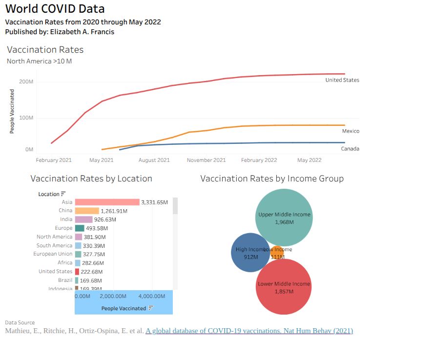

# COVID-19 Vaccination Dashboard (Tableau)

## 📊 Project Overview
This project is an interactive Tableau dashboard analyzing global COVID-19 vaccination trends. It explores vaccination rates across countries, regions, and income groups to uncover key patterns and disparities.

## 🔗 Live Dashboard
View the interactive dashboard here:  
👉 [Click to View Dashboard](PASTE_YOUR_TABLEAU_LINK_HERE)

---

## 📌 Key Insights
- Higher-income countries show significantly higher vaccination coverage compared to lower-income regions.
- Upper middle-income countries demonstrate strong vaccination growth but still lag behind high-income nations.
- Vaccination trends vary significantly across geographic regions such as North America, Europe, and Asia.
- Global disparities highlight the impact of economic factors on healthcare access.

---

## 🛠️ Tools & Technologies
- Tableau Cloud (Data Visualization)
- SQL (Calculated Fields)
- Data Cleaning & Transformation

---

## 📈 Dashboard Features
- Time-series analysis of vaccination rates
- Country-level comparisons
- Income group segmentation
- Interactive visualizations

---

## 🧠 What I Learned
- How to build interactive dashboards in Tableau Cloud
- Creating calculated fields using SQL logic
- Handling real-world data inconsistencies (string mismatches)
- Designing dashboards for storytelling and clarity

---

## 📷 Dashboard Preview

---

## 📬 Contact
Elizabeth A. Francis  
🔗 LinkedIn: https://www.linkedin.com/in/elizabeth-f-10805a2b9/
